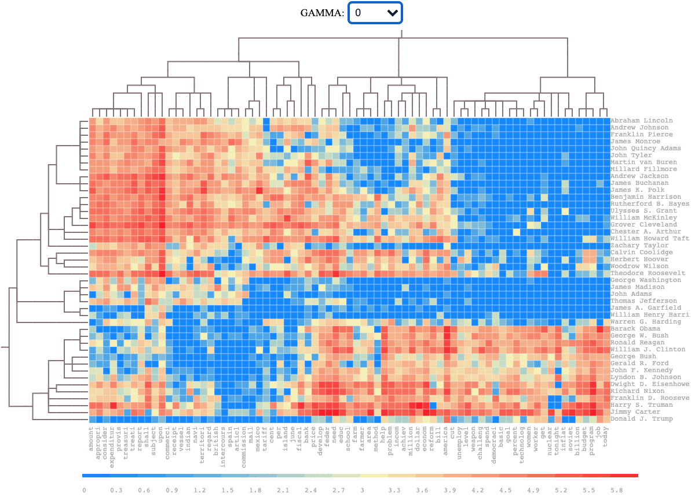

# Accelerated Full Path Solution for Convex Biclustering

This repo provides an accelerated solver implemented in C++ for convex biclustering, and generating row and column dendrogram is also supported. The source code and test data can be also found at https://zenodo.org/record/4620218#.YGx9jxNKiX0. For more information about convex biclustering, see [1].  

---

## Installation

Currently, we only support compiling the source code on Linux or MacOS. For the step-by-step installation in an empty environment, please refer to `docker/Dockerfile`.

### Prerequisite

1. g++
2. make
3. autotools (autoconf, automake, libtool)
4. python3
5. openblas and igraph

### Install the python package needed

```
pip install -r requirements.txt
```

### Compile and install the shared `libcvxclustr` library

```
cd lib/cvxclustr-0.3
autoreconf -i
./configure
make
make install
```

When you run `make install`, make sure you have the writing permission in the system library path.

### Compile the executable file

```
make
```

The executable will be called `cvxclustr_path`. This file will be called by `cvxclustr.py` to accelerate the data intensitive computation.


## Docker

We can also build this software easily with docker:

```
docker build -t [your image name] ./docker
```

The sample command using the image is provided in [`docker/Dockerfile`](./docker/Dockerfile)

# Usage

```
python3 cvxclustr.py [-h] --data DATA [--rgfile RGFILE] [--cgfile CGFILE] --gamma
                 GAMMA [--col_knn COL_KNN] [--row_knn ROW_KNN] --output OUTPUT
                 [--intermediate INTERMEDIATE] [--nthreads NTHREADS]
                 [--max_iter MAX_ITER] [--tol TOL] [--verbose {0,1}]

optional arguments:
  -h, --help            show this help message and exit
  --data DATA           path to matrix file (.csv format)
  --rgfile RGFILE       path to the row graph file
  --cgfile CGFILE       path to the column graph file
  --gamma GAMMA         sequence of gamma (comma seperated)
  --col_knn COL_KNN     k nearest neightbors used to create column weights
                        matrix
  --row_knn ROW_KNN     k nearest neighbors used to create row weights matrix
  --output OUTPUT       the path to the output file
  --intermediate INTERMEDIATE
                        the path to the output file
  --nthreads NTHREADS   number of threads to use
  --max_iter MAX_ITER   max iterations to run
  --tol TOL             tolerance of convergence
  --verbose {0,1}       printing flag
```

## Examples

This dynamic biclustering of 44 US presidents below is generated by our accelerated convex biclustering algorithm using the following command:

```
python3 cvxclustr.py --gamma 3,5,10,20,50,100,150,200,500,1000 --col_knn 2 --row_knn 4 --tol 0.001 --data data/president.csv --output data/president.json
```

<p align="center">

</p>

Besides the standalone implementation, we also provide a online server at http://cvxbiclustr.org for users to run some other interesting examples or run the algorithm on their own datasets. For more information about using the online server, see http://cvxbiclustr.org/help.php.


## References

[1] Chi, Eric C., Genevera I. Allen, and Richard G. Baraniuk. "Convex biclustering." Biometrics 73.1 (2017): 10-19.


